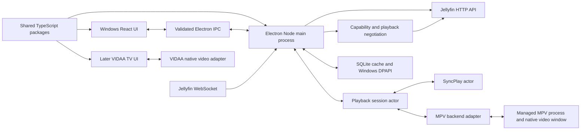

# JellyClient: standalone Jellyfin client plan

Status: revision 4 - single-action SyncPlay is a release requirement
Date: 2026-07-30

## 1. Working assumptions

Agreed scope:

- Windows 11 is the only first-release target.
- A native VIDAA TV app is a later target. It should reuse protocol and SyncPlay
  code where practical, but it will have its own TV UI and player adapter.
- The project is initially personal, not a public product.
- The long-term Windows product is a full desktop client: server login, library
  browsing, search, item details, playback, and SyncPlay.
- The first usable alpha will be playback-first with a minimal catalog.
  Browsing, joining a SyncPlay group, and playback happen in this one client
  session; a browser and cast handoff are never required.
- Compatibility with remote control/cast commands follows after local playback
  and SyncPlay are stable. A cast command must never silently play outside the
  intended SyncPlay group.
- Mandatory Windows playback features are HDR10/PQ, ASS subtitles including
  styling and fonts, PGS subtitles, and explicit audio-track selection.
- Dolby Vision is deferred to the VIDAA phase because the TV supports it through
  its native platform but the current Windows HDMI path is not Dolby Vision
  certified.
- Video is the first priority. Music, photos, downloads, and Live TV are later.

Detected reference Windows hardware:

- Windows 11 Pro, 64-bit, build 26200.
- AMD Radeon RX 7900 XT with AMD driver `32.0.31021.5001`.
- Hisense 55UR8S RGB MiniLED directly connected to the RX 7900 XT over HDMI.
- The TV supports 4K, HDR10/HDR10+, HLG, Dolby Vision, and VIDAA Smart OS.
- An LG UltraGear monitor is also connected.
- PC speakers are the Windows alpha audio output. HDMI bitstream passthrough is
  deferred.
- Jellyfin Server runs on Windows and is assumed to be the current stable
  version, 10.11.11. The client will read and log the actual server version
  during connection.

## 2. Product goal

Build a dependable desktop client for Jellyfin that:

1. Direct-plays as much media as the machine can decode.
2. Produces correct HDR or tone-mapped SDR on known display configurations.
3. Implements the Jellyfin server's SyncPlay state machine faithfully.
4. Makes SyncPlay a single-action experience: create or join once in JellyClient,
   then browse and play as part of that group without casting or joining again.
5. Keeps playback, network, and UI responsibilities isolated so that one cannot
   deadlock or stall another.
6. Makes playback decisions observable: the user can see why an item direct
   played, remuxed, or transcoded and what color/audio path was selected.
7. Recovers cleanly from buffering, WebSocket reconnection, display changes, and
   a crashed player process.

The goal is not to write a decoder. MPV/FFmpeg/libplacebo already solve that
problem far better than a new client could.

## 3. Proposed v1 and non-goals

### Playback-first alpha

- Add a Jellyfin server by URL.
- Username/password authentication.
- Secure token storage.
- Minimal movie/episode browser and search.
- PlaybackInfo negotiation and media-source selection.
- Direct play, direct stream/remux, and server transcode playback.
- Resume, watched state, progress reporting, and stop reporting.
- Explicit audio-track selection.
- Decode selected audio tracks to the Windows PC speaker output.
- ASS/SSA rendering through libass, including attached fonts.
- PGS subtitle rendering.
- HDR10 passthrough on the reference Windows setup.
- HDR-to-SDR tone mapping.
- SyncPlay create, join, leave, play, pause, seek, stop, buffering/ready, and
  queue changes.
- One-click "Create group" and "Join group" flows inside JellyClient. Creating
  or joining establishes membership for the same session that owns MPV.
- A "Watch together" action that creates and joins a group, queues the selected
  item after the join acknowledgement, and opens the player as one user action.
- Diagnostic overlay and exportable, redacted logs.

### Windows v1

- Polished home, library, series, season, episode, movie, search, and settings
  screens.
- Quick Connect.
- Multiple saved servers and users.
- Keyboard, mouse, and media-key controls.
- A local/cast-receiver mode if it does not compromise the playback state
  model. Exact group intent auto-joins; missing or ambiguous group intent never
  falls back to unsynchronized playback without telling the user.
- Reliable installer, crash recovery, and settings migration.
- Windows x64 package for the reference machine.

### Explicitly later unless requirements change

- Live TV/DVR.
- Full music player behavior such as gapless playback and playlists.
- Offline downloads.
- Photos and books.
- Chromecast/DLNA client behavior.
- Linux and macOS desktop builds.
- Dolby Vision output on Windows.
- HDMI bitstream passthrough for E-AC-3/Atmos, DTS/DTS-HD, and TrueHD.
- The VIDAA application, until the Windows protocol and playback packages are
  stable and the exact TV can run a developer/hosted app.
- A custom decoder or a fork of FFmpeg.
- Plugins or arbitrary scripts loaded from a server.

## 4. Does language matter?

Yes, but it is not the main determinant of codec or HDR quality.

The playback engine and its output window own decoding, hardware acceleration,
the GPU swapchain, color-space signaling, tone mapping, audio device access, and
subtitle rendering. The application language mainly affects development speed,
concurrency safety, packaging, native integration, and how difficult it is to
maintain the Jellyfin protocol.

### Provisional recommendation

Use:

- **TypeScript** for the Jellyfin client, WebSocket session, playback session
  state machine, SyncPlay, media negotiation, diagnostics, and shared domain
  models.
- **Electron's Node main process** as the authoritative Windows application
  core. Timing and network logic must not live in the UI renderer.
- **React + TypeScript** for the desktop library and settings UI.
- **MPV as a managed child process over JSON IPC** for Windows playback.
- Platform-neutral `PlayerBackend`, `CredentialStore`, `PlatformClock`, and
  `DeviceProfileProvider` interfaces.
- A later **HTML5/TypeScript VIDAA application** that reuses shared packages but
  implements a remote-control UI and VIDAA/native-video player backend.

Why this is the default:

- TypeScript is the practical common language between a Windows desktop shell
  and VIDAA's supported HTML5 application model.
- Electron's Node main process continues running independently of renderer
  visibility and can own MPV, Jellyfin WebSocket, scheduled SyncPlay commands,
  and ordered reporting without relying on browser-tab timers.
- The first-party Jellyfin TypeScript SDK and generated request/response types
  reduce protocol drift.
- Keeping MPV out of process lets MPV own its window and HDR swapchain, isolates
  crashes, makes upgrades replaceable, and avoids early libmpv FFI/rendering
  complexity.
- Shared code stops at a platform boundary. Windows uses MPV; VIDAA must use
  the TV's native media path to access its hardware HDR/Dolby Vision behavior.

This is now the recommended starting stack. It should be reconsidered only if
Electron's footprint is unacceptable or a single embedded video surface is a
hard requirement.

### Alternatives

| Stack | Strength | Cost or risk | Choose it when |
|---|---|---|---|
| TypeScript + Electron + React + MPV IPC | Maximum Windows/VIDAA code sharing; official SDK; one language | Larger Windows runtime and memory use | Recommended for the agreed Windows-first and VIDAA-later plan |
| Rust + React/TypeScript + MPV IPC | Small, strongly typed native core and replaceable player | Two implementations for VIDAA protocol/SyncPlay or a future WASM bridge | Windows reliability/footprint outweighs TV code sharing |
| C#/.NET + Avalonia + MPV IPC | Fast Windows/Linux development, excellent async primitives | No first-party Jellyfin C# client SDK; UI ecosystem is smaller | The developer is substantially stronger in C# |
| C++ + Qt/QML + libmpv | Maximum direct native and libmpv control | Highest build, memory-safety, and packaging burden | Seamless embedded video is mandatory from day one |
| Python + MPV IPC | Excellent for experiments | Packaging, concurrency, and long-running state ownership are weaker | Short-lived protocol/player spike only |

Do not choose a stack merely because it can display a browser page. The
technology spike in milestone 1 must prove HDR, frame pacing, IPC, and
multi-monitor behavior on the reference machine.

## 5. Proposed architecture



### Ownership rules

- The Electron renderer owns presentation state only. It has no Node access and
  receives an allowlisted preload API.
- The Electron main process owns all authoritative Windows application state.
- The Jellyfin connection actor owns authentication, HTTP client instances,
  WebSocket connection/reconnect, and server-version capability detection.
- The playback session actor is the only writer of the current playback state.
- The MPV adapter translates player properties/events; it does not make
  Jellyfin decisions.
- The SyncPlay actor owns group membership, clock offset, scheduled group
  commands, buffering/ready state, and drift correction.
- Network callbacks and MPV event callbacks enqueue messages and return
  immediately. They never perform blocking playback or HTTP work.
- Timeline reports use a single-writer queue and a playback generation/session
  ID. Old reports are discarded, not protected by nested locks.
- No synchronous filesystem, child-process, or network call is permitted on the
  main event path.
- The future VIDAA application reuses pure shared packages, not Electron code.

### Suggested repository layout

```text
JellyClient/
  package.json
  pnpm-workspace.yaml
  apps/
    windows/
      main/                  # Electron main process
      preload/               # Narrow validated renderer bridge
      renderer/              # React desktop UI
    vidaa/                   # Added in the later TV phase
  packages/
    jellyfin-protocol/       # Official/generated DTOs and compatibility layer
    jellyfin-client/         # Auth, HTTP, WebSocket, discovery
    media-negotiation/       # Shared rules plus platform capability inputs
    playback-core/           # Platform-neutral session state machine
    player-contract/         # Player commands, events, and capability types
    player-mpv/              # Windows MPV process and JSON IPC adapter
    player-vidaa/            # Added later for the native TV media path
    syncplay/                # Pure protocol, clock, scheduler, correction model
    persistence/             # Settings, cache, migrations, credentials
    diagnostics/             # Structured logs and support bundle
    ui-domain/               # View models reusable across form factors
  tests/
    fixtures/
    protocol/
    integration/
    media-matrix/
  docs/
    decisions/
    PROJECT_PLAN.md
    TEST_MATRIX.md
```

## 6. Jellyfin integration plan

### API contract

- Pin a known Jellyfin OpenAPI snapshot.
- Generate DTOs into `jellyfin-protocol`; never edit generated files by hand.
- Put server-version differences behind handwritten compatibility wrappers.
- Test against the two most recent supported stable server versions and current
  server main in a non-blocking CI job.
- Record the server version and enabled features at login.
- Treat Jellyfin server source as authoritative for SyncPlay behavior. The
  server exposes the REST commands in
  [`SyncPlayController.cs`](https://github.com/jellyfin/jellyfin/blob/b15d3c9ad31d6a2f7e940d0372d9f3b93c5f9e95/Jellyfin.Api/Controllers/SyncPlayController.cs).

### Connection and authentication

1. Normalize the user-entered base URL, including path prefixes.
2. Call public system information and validate that the endpoint is Jellyfin.
3. Authenticate and save only the access token and necessary server/user IDs.
4. Store tokens with the Windows credential/DPAPI-backed implementation. Never
   store a password after login.
5. Open the authenticated WebSocket and implement keepalive, exponential
   reconnect with jitter, and a full session-state resync after reconnect.
6. Add Quick Connect after ordinary login is stable.
7. Never silently disable TLS validation. Offer a clearly labeled advanced
   trust flow for self-signed certificates later.

### Catalog/domain layer

- Map large generated API objects into small domain models used by the UI.
- Cache server identity, user preferences, recently viewed metadata, and image
  URLs. The server remains the source of truth.
- Cancel stale list/image requests when navigation changes.
- Use pagination and virtualization from the first real library screen.
- Keep all destructive server actions out of v1 unless explicitly designed.

### Playback negotiation

For each play request:

1. Probe local capabilities at startup and when the GPU/audio/display changes.
2. Build a conservative Jellyfin device profile from tested facts, not broad
   codec guesses.
3. Request PlaybackInfo.
4. Rank returned media sources.
5. Decide direct play, direct stream/remux, or transcode and retain the server's
   reasons.
6. Build the authenticated media URL without leaking the token into logs.
7. Load MPV with explicit video, audio, subtitle, hardware decode, and cache
   settings.
8. Wait for file-loaded plus required track/decoder state before reporting
   playback started.
9. Send periodic progress, pause, seek, and stop reports through a serialized
   reporting queue.
10. Close the transcode session on stop, error, item transition, and app exit.

Jellyfin's codec guide distinguishes direct play, remux, and transcode and is a
useful baseline for the test matrix:
[Jellyfin codec support](https://jellyfin.org/docs/general/clients/codec-support/).

## 7. Player backend and HDR plan

### Why MPV first

MPV already supports the codecs, containers, ASS/SSA/PGS subtitle paths,
hardware decoders, audio passthrough, shaders, libplacebo color management, and
the timing controls SyncPlay needs. Its current manual recommends `gpu-next`
and explains `target-colorspace-hint` for HDR/color-space signaling:
[MPV manual](https://mpv.io/manual/stable/).

### Backend contract

The application depends on an interface approximately like:

```text
load(source, start_position, tracks, playback_profile)
play()
pause()
seek_absolute(position)
stop()
set_speed(rate)
select_audio(track)
select_subtitle(track_or_none)
observe(position, pause, seeking, buffering, eof, tracks, video_params, errors)
query_diagnostics()
```

No SyncPlay or Jellyfin HTTP code belongs in the backend.

### Initial process model

- Bundle a tested MPV build for ordinary users, while allowing an advanced
  custom executable path.
- Start it with a per-launch random named pipe/socket and restricted local
  permissions.
- Use JSON IPC; correlate commands and replies with request IDs.
- Observe at least: `time-pos`, `duration`, `pause`, `seeking`,
  `paused-for-cache`, `eof-reached`, `speed`, `aid`, `sid`, `track-list`,
  `video-params`, `video-out-params`, `hwdec-current`, and error/end events.
- Detect hangs with a heartbeat. Kill/restart only the child process after a
  bounded graceful shutdown attempt.
- The first alpha may use MPV's native OSC/player window. A custom overlay or
  embedded libmpv backend is a later decision after HDR is proven.

### HDR modes

Expose three user-visible modes:

1. **Auto**: output HDR when the display path reports HDR; otherwise tone-map to
   SDR.
2. **Force SDR tone mapping**: useful for SDR displays, screenshots, remote
   desktops, or broken driver paths.
3. **HDR passthrough/target output (advanced)**: use explicit tested MPV output
   settings and display metadata.

Do not market a single "HDR supported" checkbox. Test these independent paths:

- SDR source on SDR display.
- HDR10 source on HDR display.
- HDR10 source on SDR display.
- SDR source while Windows HDR mode is enabled.
- Fullscreen and windowed.
- Moving playback between SDR and HDR monitors.
- H.264, HEVC Main10, VP9 Profile 2, and AV1 where hardware supports them.
- 8-bit and 10-bit output; limited/full range; BT.709 and BT.2020.
- Tone mapping with and without hardware decoding.
- Subtitle brightness/color on HDR content.

Diagnostics must show source primaries/transfer/matrix, decoder, output
primaries/transfer, tone-mapping mode, display, refresh rate, dropped frames,
and whether the server transcoded.

Dolby Vision is not a Windows v1 target. Profile, container, base-layer
fallback, OS/display support, and dynamic metadata behavior vary, and the
current Windows HDMI path is not certified for it. Preserve Dolby Vision
metadata during direct-play negotiation where safe, but validate actual Dolby
Vision output later through the TV-native VIDAA path.

### Audio and subtitles

- Detect output devices and expose stereo/downmix versus passthrough profiles.
- Treat AC-3, E-AC-3, DTS, DTS-HD, TrueHD, and channel-layout support as
  device-specific.
- Fall back to server audio transcode when passthrough is not valid.
- Support internal and external text subtitles first, then image subtitles.
- Let MPV/libass render ASS/SSA and attached fonts.
- Verify forced/default/hearing-impaired selection rules with fixtures.
- Track mapping must use Jellyfin stream indices and MPV track IDs explicitly;
  never assume they are the same.

### Future VIDAA player

VIDAA is not a second build of the Windows executable. It is a separate HTML5
application that can reuse TypeScript packages and domain behavior.

VIDAA's published material says:

- HTML5 hosted applications are the recommended application type.
- The TV platform has proprietary JavaScript/system media APIs in addition to
  standard web APIs.
- Native Linux applications exist but require a substantially longer partner
  integration process.
- Hardware and browser combinations vary, so the precise TV model is required.

The later VIDAA design should:

- use the TV's native `<video>` or partner media API so the TV owns hardware
  decode, HDR10, and Dolby Vision output;
- implement a dedicated conservative Jellyfin device profile;
- test Dolby Vision by profile and container rather than advertising a generic
  capability, beginning with profiles 5 and 8 in MP4 and an HDR10 fallback;
- treat profile 7, enhancement layers, MKV Dolby Vision, and dynamic metadata
  as unsupported until proven on the exact set;
- provide explicit remote-control focus/navigation and a 10-foot UI;
- transpile and polyfill for the TV's actual browser generation;
- support audio-track switching only where the native player exposes it;
- direct-render ASS only when the device proves correct style/font behavior;
- request server subtitle burn-in for PGS and any ASS case the TV cannot render;
- request audio transcode when the selected track or output topology is not
  supported;
- keep SyncPlay independent from the media element behind `PlayerBackend`.

The old public technical guide lists ASS/SSA support on some VIDAA platforms,
but that is not enough to claim compatibility for the current TV. PGS and
Dolby Vision must be verified on-device.

Personal deployment is a separate feasibility gate. VIDAA's developer portal
is restricted to partners, and official app integration is partnership-led.
We must first determine whether this particular television/firmware exposes a
supported developer or hosted-app testing route. The plan must not depend on an
unofficial installation workaround.

## 8. SyncPlay design

SyncPlay is not a small UI feature. It is a distributed state machine with
clock synchronization, scheduled commands, buffering barriers, queue state,
and local player correction.

### Primary user experience: join once

JellyClient's catalog UI and MPV-backed playback engine are two parts of one
Jellyfin device/session. This removes the browser-to-shim split that currently
forces the user to join twice.

The required flows are:

1. **Create group:** clicking "Create group" sends the create request. The
   server automatically adds this JellyClient session; the UI waits for the
   `GroupJoined` update and then shows the persistent group bar.
2. **Join group:** clicking a group once sends the join request. On
   `GroupJoined`, the client accepts the group's queue/state, prepares the
   current item if any, reports Buffering/Ready as appropriate, and converges to
   the group. There is no separate player join and no cast step.
3. **Watch together:** from an item page, one action creates the group, waits
   for confirmed membership, sends `SetNewQueue`, and opens the player. It must
   not start locally before the group owns the queue.
4. **Play while joined:** every play, pause, seek, stop, next, and queue action
   is routed through SyncPlay. A local `Sessions/{id}/Playing` command is not
   used to start group playback.
5. **Stop versus leave:** stopping playback keeps group membership. Only an
   explicit "Leave group", logout, server switch, or defined fatal-session
   recovery leaves it.
6. **Restart/reconnect:** while the same server session can be restored, the
   client reconciles membership and group state automatically. It never asks
   the user to join the same group a second time merely because MPV or the
   renderer restarted.

The group bar remains visible in the catalog and player and shows group name,
participants, current state, buffering member, and a deliberate Leave action.
The player window opening or closing has no effect on group membership.

### Group-intent router and cast compatibility

All ways of starting media feed one serialized `GroupIntent` router owned by
the main process. Its invariants are:

- confirmed group membership is authoritative, not renderer state;
- create/join/leave/load commands are idempotent and ordered;
- an item cannot enter `Playing` until its group intent is resolved;
- a group item is loaded paused/preparing, followed by Buffering/Ready, and
  starts only from a server SyncPlay command;
- failure to join is visible and cannot degrade into unsynchronized playback.

Current Jellyfin remote play has an important limitation. The standard Web
client sends `ItemIds`, `PlayCommand`, position, media source, and track
indexes, but no SyncPlay group ID. The current server `PlayRequest` model also
has no group field. Browser membership therefore cannot be reliably transferred
to a separate playback-target session by the standard cast command. This is the
protocol reason for the double-join workflow, not merely a UI bug. The relevant
current paths are Jellyfin Web's
[`sessionPlayer/plugin.js`](https://github.com/jellyfin/jellyfin-web/blob/ef9dc297f0447950f38623a82bf10dfbd294d6cb/src/plugins/sessionPlayer/plugin.js)
and the server's
[`PlayRequest.cs`](https://github.com/jellyfin/jellyfin/blob/b15d3c9ad31d6a2f7e940d0372d9f3b93c5f9e95/MediaBrowser.Model/Session/PlayRequest.cs).

Receiver compatibility is consequently tiered:

1. A capable sender that includes an exact `SyncPlayGroup` intent is handled
   automatically: join that group idempotently, prepare, report Ready, and wait
   for group authority.
2. If the target is already a confirmed member, an incoming remote item request
   is routed into that existing group rather than played locally.
3. If the command has no group ID, the client may offer an opt-in personal-use
   convenience: auto-join only when exactly one accessible group is an
   unambiguous match for the controlling user. If there is zero or more than one
   match, show a group chooser/error; never guess.
4. Fully reliable browser-to-receiver transfer without a second join requires a
   future companion sender, browser extension, Jellyfin Web contribution, or
   server/plugin protocol extension that transmits the group ID. It is not on
   the critical path because the standalone client already provides the
   preferred join-once flow.

If a cast requests a different exact group while the target is already joined,
the command is treated as explicit user intent: leave the old group, wait for
confirmation, join the requested group, then prepare playback. Any failure
leaves playback stopped with an actionable error.

### Protocol model

Implement the server's group states explicitly:

- Idle
- Waiting
- Paused
- Playing

Handle:

- group create/join/leave;
- group and user updates;
- play queue updates;
- `Unpause`, `Pause`, `Seek`, and `Stop` commands;
- `Buffering`, `Ready`, `Ping`, and `SetIgnoreWait`;
- reconnect and "not in group" recovery.

A seek is a barrier: the server can mark all members buffering and wait for
each to report Ready. The client must report Ready even after a very fast seek.
The current server behavior is visible in
[`WaitingGroupState.cs`](https://github.com/jellyfin/jellyfin/blob/b15d3c9ad31d6a2f7e940d0372d9f3b93c5f9e95/MediaBrowser.Controller/SyncPlay/GroupStates/WaitingGroupState.cs).

### Clock synchronization

- Use the four timestamps from the server time endpoint to calculate NTP-style
  offset and round-trip delay.
- Take a short burst of samples on join/reconnect.
- Retain a small rolling window and use the sample with minimum network delay
  as the offset estimate.
- Refresh periodically and immediately after a network/interface change.
- Use a monotonic clock for elapsed durations and wall/server time only for
  protocol timestamps.
- Record offset, half-RTT, jitter, sample age, and correction decisions.

Jellyfin Web currently tracks eight measurements, chooses the minimum-delay
sample, polls rapidly at first, and then backs off; this is a useful behavioral
reference, not the server specification:
[`TimeSync.js`](https://github.com/jellyfin/jellyfin-web/blob/ef9dc297f0447950f38623a82bf10dfbd294d6cb/src/plugins/syncPlay/core/timeSync/TimeSync.js).

### Command scheduling

- Convert a server `When` timestamp to a local monotonic deadline using the
  latest offset estimate.
- Put scheduled commands into the SyncPlay actor; never sleep a network thread.
- Tag commands with playback generation and playlist item ID.
- Ignore stale generations, but do not mistake a newly emitted server resync
  for a duplicate command.
- For a late unpause, estimate the group position at the local execution time
  and seek before/while unpausing.
- Local user controls send a request to the group; they do not immediately
  mutate authoritative group state unless the protocol requires optimistic UI.

### Drift correction

Start with configurable conservative thresholds, then tune from measurements:

- Less than roughly 50-80 ms: no correction.
- Moderate drift up to roughly 300-500 ms: temporarily adjust playback speed
  in a narrow band, with hysteresis and a cooldown.
- Larger drift, wrong item, or failed soft correction: absolute seek.
- Disable correction while paused, seeking, loading, or buffering.
- Reset speed to exactly `1.0` after correction.
- Account for non-1.0 user playback speed by applying correction relative to
  the group rate, not by assuming 1.0.

These numbers are starting hypotheses, not acceptance values. The network test
matrix determines the final thresholds.

### Concurrency rules

- One SyncPlay actor, one playback actor, and message passing between them.
- No synchronous HTTP from MPV event callbacks.
- No playback start/seek from the WebSocket reader callback.
- No nested player/timeline locks.
- Progress and stopped reports go through one ordered writer.
- Every load increments a generation number; delayed work checks it.
- A bounded queue and coalescing are used for high-frequency position events.
- State transitions are pure/testable where possible; effects are emitted as
  commands.

### SyncPlay acceptance tests

- Create or join once in JellyClient, then browse and play with no browser,
  cast action, or second join.
- Use "Watch together" from an item page and reach the group lobby/player from
  one user action.
- Keep group membership while MPV opens, closes, crashes, or restarts.
- Reject ambiguous or failed receiver auto-join without unsynchronized playback.
- Two and three clients on the same LAN.
- One client with 50/100/250 ms latency.
- Jitter, packet loss, bandwidth throttling, and a temporary disconnect.
- One slow-buffering and one fast local/direct-path client.
- Repeated play/pause/seek/stop from every member.
- Join while playing, join while paused, leave/rejoin, host exit.
- Queue replacement, next episode, remove current item, repeat, and shuffle.
- Fast seek must not leave the group waiting.
- Cache underrun must pause the group and Ready must resume it.
- WebSocket reconnect must not create duplicate playback or stale reports.
- Thirty-minute soak with no deadlock; two-hour soak before public beta.

Initial performance target: after clock warm-up and outside buffering/seeks,
p95 absolute drift under 100 ms on a healthy LAN and recovery to under 150 ms
within five seconds after an induced 300 ms disturbance. Revise after baseline
measurements against Jellyfin Web and MPV Shim.

## 9. Persistence, diagnostics, and security

### Persistence

- SQLite for server profiles, non-secret settings, UI state, cached domain
  metadata, and schema migrations.
- Electron `safeStorage`/Windows DPAPI for tokens in the personal Windows
  build, behind a `CredentialStore` interface.
- Versioned settings with forward-only migrations and backup-on-migration.
- No cache is required for correctness.

### Diagnostics

- Structured logs with session/generation IDs.
- Automatic redaction of access tokens, passwords, authorization headers,
  media query tokens, and sensitive URL components.
- Separate event streams for Jellyfin requests, WebSocket messages, SyncPlay
  decisions, player events, and render/audio facts.
- In-app "copy diagnostics" and "create support bundle."
- A stats overlay showing server mode, bitrate, codecs, tracks, decoder,
  color path, cache, dropped frames, clock offset, RTT, and SyncPlay drift.
- Optional local-only metrics; no external telemetry by default.

### Security

- Treat server metadata, images, subtitle text, and URLs as untrusted.
- Keep UI/core IPC allowlisted and typed.
- Restrict local MPV IPC access and use an unpredictable endpoint.
- Do not pass arbitrary server metadata as command-line options.
- Do not allow remote pages to invoke native bridge methods.
- Ship a dependency/license inventory and vulnerability scan in CI.

If publicly distributed, choose a distinct name and logo. Jellyfin's branding
rules allow wording such as "X for Jellyfin" but not a name that implies an
official client:
[Jellyfin branding](https://jellyfin.org/docs/project/branding/).

## 10. Delivery milestones

Estimates below assume one developer working consistently and already
comfortable in at least one proposed language. They are ranges, not promises.

### Milestone 0: requirements and test lab (2-4 days)

Deliver:

- Answered scope/platform questions.
- Reference hardware and media inventory.
- Dedicated test Jellyfin server with non-valuable test data.
- Initial codec/HDR/audio/subtitle matrix.
- Architecture decision record for language and player-window model.

Exit criteria:

- We can state exactly what "HDR works" and "SyncPlay works" mean on named
  hardware.
- v1 and non-goals are agreed.

### Milestone 1: risk-reduction playback spike (4-7 days)

Build a disposable Node/Electron harness that:

- launches MPV;
- controls it over JSON IPC;
- observes the required properties;
- plays a local SDR and HDR file;
- plays an authenticated Jellyfin direct URL;
- pauses, seeks, changes speed, and detects real cache buffering;
- exports render diagnostics.

Use MPV's own native window first. Record whether a future embedded option is
still desirable after HDR and controls are tested.

Exit criteria:

- Correct HDR10 and HDR-to-SDR are visually and diagnostically verified on the
  reference setup.
- The selected player model survives 100 load/stop cycles.
- Speed correction and absolute seek are measurable.
- We commit or reconsider the provisional stack.

### Milestone 2: repository foundation (3-5 days)

- pnpm TypeScript monorepo with Electron main, preload, and React renderer
  workspaces.
- Formatting, linting, unit tests, dependency checks, and Windows CI.
- Runtime-validated, typed main/renderer command and event schemas.
- Structured redacted logging.
- Settings and credential abstraction.
- ADRs for player backend, threading model, API generation, and licensing.

Exit criteria:

- Clean checkout builds and tests with one documented command.
- Secrets are absent from normal logs.

### Milestone 3: Jellyfin connection and minimal catalog (1-2 weeks)

- Server add/validation and username login.
- Authenticated HTTP and WebSocket with reconnect.
- Home rows, libraries, search, details, and images.
- Domain mapping, pagination, cancellation, and caching.
- Quick Connect if basic login is stable.

Exit criteria:

- Restart restores an authenticated server session from the credential vault.
- The app handles server offline/online transitions.
- Large libraries do not load all items into memory.

### Milestone 4: playback lifecycle (1-2 weeks)

- Capability probe and device profile.
- PlaybackInfo/media-source selection.
- Direct play, remux, and transcode URLs.
- Start/progress/pause/seek/stop reporting.
- Resume and watched-state update.
- Queue and automatic next episode.
- Audio and subtitle selection.
- User-readable playback decision and transcode reason.

Exit criteria:

- All three delivery modes are exercised deliberately.
- Stopping always closes the transcode session.
- A stale event cannot affect the next item.

### Milestone 5: HDR, audio, and subtitle hardening (1-2 weeks)

- Auto/HDR/force-SDR profiles.
- Multi-monitor and display-change behavior.
- Hardware decoder fallback.
- Passthrough/device profiles.
- ASS/attached fonts, SRT, PGS, forced/default selection.
- Media matrix automation where possible and a manual visual checklist where
  measurement is not sufficient.

Exit criteria:

- Reference HDR matrix passes.
- The app never claims direct play for a known unsupported output path.
- Fallback behavior is visible and recoverable.

### Milestone 6: SyncPlay protocol and clock (1-2 weeks)

- Group API and WebSocket messages.
- Server-conformant state reducer.
- Serialized `GroupIntent` router and confirmed membership model.
- One-click create, join, and "Watch together" orchestration.
- Clock synchronization and command scheduler.
- Play/pause/seek/stop and queue changes.
- Buffering/Ready/IgnoreWait behavior.
- Conformance mock based on current server source.

Exit criteria:

- Protocol state tests cover every server state and command.
- The standalone create/join/play path never requires a browser, cast action, or
  duplicate group join.
- A join failure cannot begin local unsynchronized playback.
- Fast seek does not strand a group in Waiting.
- Network/player callbacks never perform blocking effects.

### Milestone 7: SyncPlay correction and chaos tests (1-2 weeks)

- Drift measurement and diagnostics.
- Soft speed correction, hard seek, hysteresis, and cooldown.
- Reconnect/resync behavior.
- Network fault injection and multi-client harness.
- Soak and deadlock tests.

Exit criteria:

- Agreed drift targets pass.
- Thirty-minute automated stress run and two-hour manual soak pass.
- No stale command crosses playback generations.

### Milestone 8: product UX and resilience (2-3 weeks)

- Complete v1 navigation and settings.
- Persistent catalog/player group bar, participants, state, and explicit leave.
- Player controls/hotkeys/media keys.
- Errors with actionable recovery.
- Multiple servers/users.
- Crash recovery and support bundles.
- Accessibility, localization-ready strings, and keyboard navigation.

Exit criteria:

- A new user can install, connect, browse, play, diagnose a transcode, and join
  SyncPlay once without a browser, cast handoff, second join, or configuration
  file edits.

### Milestone 9: packaging and beta (1-2 weeks)

- Reproducible MPV/runtime bundling.
- Windows installer and uninstall.
- Code-signing plan; update channel design.
- License/attribution inventory and branding check.
- Clean-machine, upgrade, rollback, and antivirus false-positive tests.

Exit criteria:

- Installer passes a clean VM test.
- No token appears in logs, crash reports, process command lines, or bundles.
- Known limitations and supported matrix are published.

Approximate total for a serious solo Windows v1: **8-14 weeks**, depending on
experience, UI polish, and whether embedded single-window video becomes
mandatory. A useful playback-first alpha should arrive much earlier, around
**3-6 weeks**. The VIDAA feasibility spike and TV application are a separate
later estimate.

## 11. Test strategy

### Unit

- URL normalization and auth-header creation.
- Device-profile generation.
- Media-source ranking and transcode reasons.
- Playback state transitions and generation invalidation.
- NTP offset/delay calculations.
- SyncPlay reducer, scheduling, deduplication, and correction decisions.
- Track mapping and subtitle/audio preference rules.
- Log redaction.

### Protocol/conformance

- Generate request/response fixtures from a disposable real server.
- Port the server SyncPlay state transitions into a small deterministic test
  model, with tests that ensure the model still matches server source behavior.
- Replay captured WebSocket sequences.
- Run a version matrix against supported Jellyfin containers.

### Player integration

- Headless tests for IPC framing and process lifecycle.
- Real MPV tests with synthetic short media.
- Faults: malformed response, process exit, hung IPC, slow load, cache
  underrun, unsupported hardware decoder, audio-device loss.

### End-to-end

- Dedicated Jellyfin server populated with redistributable/synthetic fixtures.
- Two or more isolated client processes.
- Network fault injection.
- Screenshot/manual visual checks for HDR and subtitles, plus MPV diagnostics.
- Clean VM installer tests.

### Media fixture matrix

Track at minimum:

- H.264 8-bit, H.264 Hi10P, HEVC Main/Main10, VP9, AV1.
- MP4, MKV, MPEG-TS, and HLS.
- SDR BT.709, HDR10/PQ BT.2020, HLG if required.
- AAC, FLAC, Opus, AC-3, E-AC-3, DTS, TrueHD as legally obtainable fixtures
  permit.
- Stereo, 5.1, 7.1, passthrough, and downmix.
- SRT, WebVTT, ASS with fonts, PGS, forced, SDH, internal, and external.
- Direct play, remux, video transcode, audio-only transcode, subtitle burn-in.

## 12. Risk register

| Risk | Early mitigation |
|---|---|
| HDR differs by GPU, driver, monitor, and OS mode | Named reference setups, diagnostics, conservative profiles, test before UI |
| Embedded UI composition breaks HDR | Let MPV own its window in alpha; keep backend replaceable |
| SyncPlay protocol has little formal client documentation | Test against server source and real server; maintain conformance fixtures |
| WebSocket/player/network callbacks deadlock | Actor ownership, queues, generations, no blocking callbacks |
| Incorrect device profile causes needless transcodes or failed direct play | Capability probe plus conservative tested matrix and visible reasons |
| Bundled MPV/FFmpeg licensing and codec patent concerns | Decide distribution/license policy before bundling; ship notices and source obligations |
| Jellyfin API changes | Pinned generated protocol, compatibility wrappers, server-version CI |
| Electron footprint is larger than desired | Accept it for the personal alpha; measure it before reconsidering the stack |
| Dolby Vision scope expands unpredictably | Keep it out of Windows v1; test profiles/containers only on the exact VIDAA TV |
| VIDAA cannot run a personal developer app | Treat on-device deployment as a feasibility gate; do not block Windows work |
| VIDAA browser/player capabilities differ by hardware generation | Separate device profile and on-device media matrix |

## 13. Engineering rules

- Every playback load has a unique session and generation ID.
- Only one component may mutate each major state machine.
- Events are facts in past tense; commands are requests in imperative form.
- No token in a URL passed on a process command line when a header/cookie option
  can be used safely.
- No broad "supports codec" declaration without profile, level, bit depth,
  container, audio, subtitle, and output constraints.
- Every fallback has a diagnostic reason.
- Fix protocol bugs with a failing test first.
- Avoid copying a historical client implementation blindly. Compare it with
  current server behavior.
- Keep player-specific code behind the backend interface.
- A dedicated test server is mandatory; do not develop destructive or unstable
  behavior against a valuable library.

## 14. First implementation backlog after decisions

1. Confirm the recorded 55UR8S/RX 7900 XT/PC-speaker environment at prototype
   startup and read the actual Jellyfin server version.
2. Populate `TEST_MATRIX.md` with exact HDR10, ASS, PGS, and audio sample-file
   metadata.
3. Write ADR-0001 for TypeScript/Electron and ADR-0002 for MPV process/window
   ownership.
4. Build the Node MPV IPC/HDR spike on the RX 7900 XT and Hisense TV.
5. Measure load, pause, seek, speed correction, buffering, HDR output, ASS, PGS,
   and audio-track switching.
6. Scaffold the pnpm monorepo, Windows CI, and validated Electron IPC schema.
7. Add the official Jellyfin TypeScript SDK behind a compatibility wrapper.
8. Implement server validation, login, secure token storage, and WebSocket
   reconnect.
9. Implement PlaybackInfo negotiation and one movie playback end to end.
10. Build the SyncPlay conformance model before adding the SyncPlay UI.

## 15. References used for this draft

- [Jellyfin SyncPlay REST controller](https://github.com/jellyfin/jellyfin/blob/b15d3c9ad31d6a2f7e940d0372d9f3b93c5f9e95/Jellyfin.Api/Controllers/SyncPlayController.cs)
- [Jellyfin SyncPlay server state implementations](https://github.com/jellyfin/jellyfin/tree/b15d3c9ad31d6a2f7e940d0372d9f3b93c5f9e95/MediaBrowser.Controller/SyncPlay/GroupStates)
- [Jellyfin Web SyncPlay client](https://github.com/jellyfin/jellyfin-web/tree/ef9dc297f0447950f38623a82bf10dfbd294d6cb/src/plugins/syncPlay)
- [Jellyfin TypeScript SDK](https://github.com/jellyfin/jellyfin-sdk-typescript)
- [Jellyfin codec support](https://jellyfin.org/docs/general/clients/codec-support/)
- [Jellyfin Server releases](https://github.com/jellyfin/jellyfin/releases)
- [MPV stable manual](https://mpv.io/manual/stable/)
- [Hisense 55UR8S official specifications](https://hisense.fr/produit/televiseurs/rgb-miniled-tv/TV-SET-55UR8S-HSN/p/000000000020019612)
- [Jellyfin branding rules](https://jellyfin.org/docs/project/branding/)
- [Jellyfin client-list requirements](https://jellyfin.org/docs/general/clients/)
- [VIDAA partner/application overview](https://www.vidaa.com/is-ortaklari/)
- VIDAA WebApp Development Technical Guide, revision 2.3.5 (archived; its
  former official PDF URL is no longer directly served)

## 16. Decisions and remaining questions

Agreed:

- Windows first; VIDAA later.
- Personal/private initially.
- TypeScript should be the cross-platform language.
- Electron main + React renderer + managed MPV process is the Windows stack.
- MPV may own a separate borderless/fullscreen playback window.
- Reference display is the Hisense 55UR8S directly connected to the RX 7900 XT.
- HDR10/PQ, ASS with fonts/styling, PGS, and audio-track selection are mandatory
  on Windows.
- Windows audio is decoded to PC speakers; bitstream passthrough is later.
- Jellyfin Server is on Windows and the stable 10.11.11 protocol is the
  baseline. The actual version is detected at runtime.
- Dolby Vision is deferred to the native VIDAA playback path.
- Start playback-first and grow into a full browsing client. Receiver/casting
  mode follows once the same playback session model can support it safely.

Remaining inputs, but not blockers for the Windows playback spike:

1. Representative problematic files: codec/container, HDR metadata, subtitle
   type, and audio layout. `ffprobe` output is sufficient; media files need not
   be shared.
2. Your TypeScript/React/Node experience, so task size and explanations can be
   calibrated.
3. Hobby pace and any desired date for the first usable alpha.
4. Exact VIDAA version and TV firmware before the later VIDAA feasibility
   phase.
